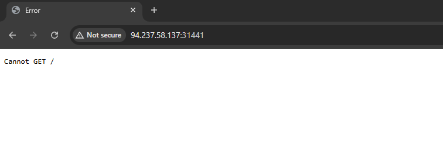
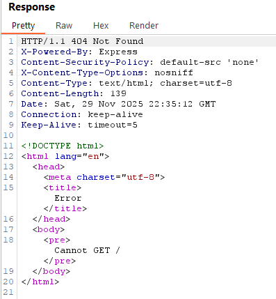

# HTB Write-Up: Dark Runes (https://app.hackthebox.com/challenges/Dark%20Runes)


## Table of Contents

1. [Challenge Overview](#challenge-overview)
2. [Methodology](#methodology)
3. [Answer](#answer)
4. [Conclusion](#conclusion)

---

## Challenge Overview

- **Name**: Dark Runes
- **Category**: Web
- **Difficulty**: Easy
- **Description**: Survivors find a battered laptop in the rubble. Powering it up, they discover a cryptic software interface from an ancient architecture firm, hinting at vital blueprints. They must crack its security protocols. Undeterred, they race against time.
- **Created By**: Kahla
- **Date**: 11/29/2025

---

| Acronym     | Meaning                                                 |
| :---------- | :------------------------------------------------------ |
| TARGET_IP   | Spawned Target Machine IP Address                       |
| TARGET_PORT | Spawned Target Machine Port                             |
| PMN_BOX     | Personal Machine with a Connection to the Academy's VPN |
| PWN_IP      | Pwnbox IP Address (or PMVPN IP Address)                 |
| PWN_PORT    | Pwnbox Port (or PMVPN Port)                             |

---

## Methodology

Navigate to the http://TARGET_IP:TARGET_PORT and you are greeted with a server 404 page that states "Error, Cannot GET /".



Looking into the actual request we say that we are gettting a `404 Not Found` error, from an Express Server.



## Answer

### Flag

```
HTB{ROOT}
```

## Conclusion
